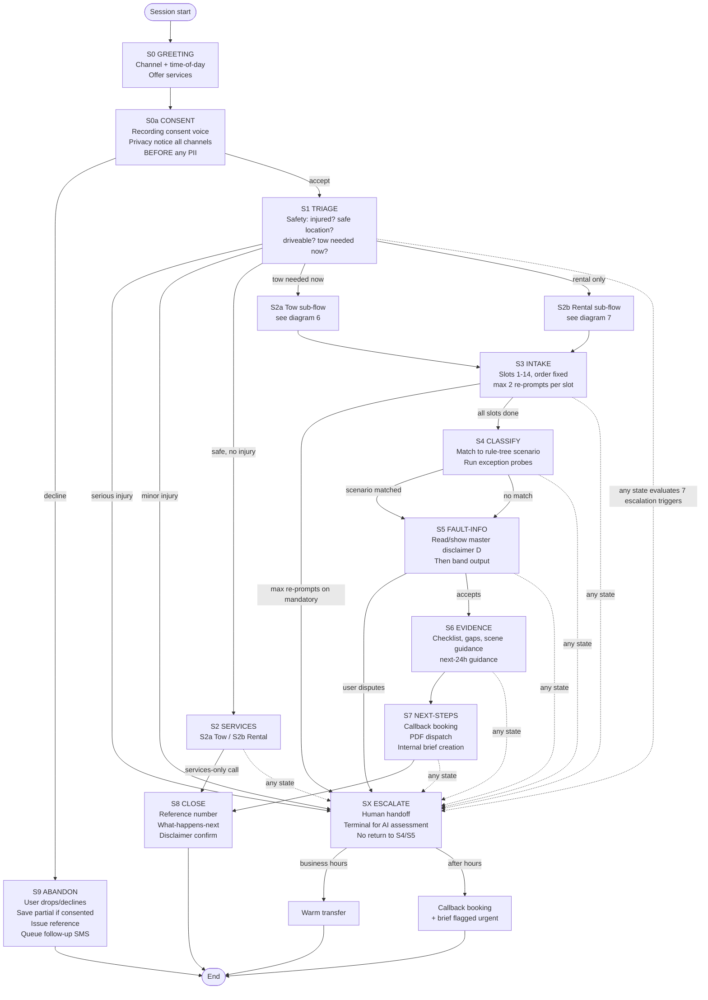
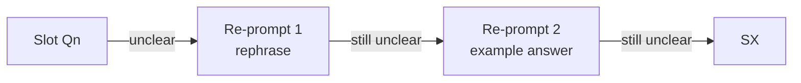
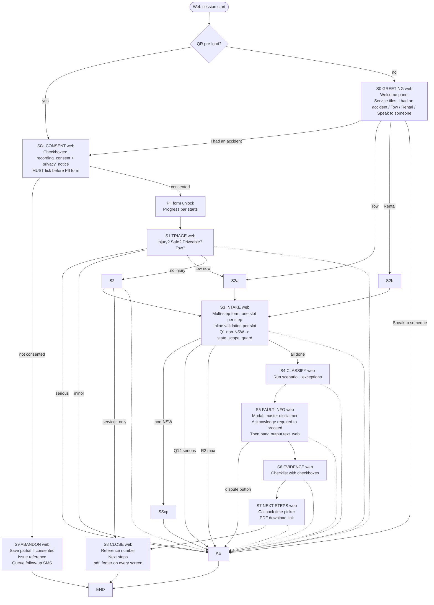
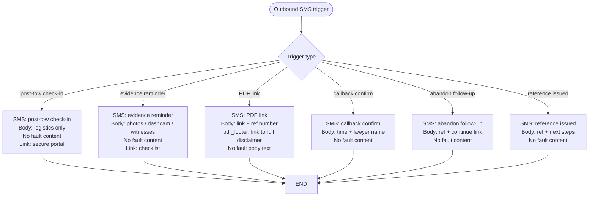

# Conversation Flow Diagrams — D1
**Project:** AI Legal Receptionist + Accident Intake System
**Companion to:** `spec/conversation-flow.v1.md` (binding)
**Format:** Mermaid `flowchart TD` (top-down). One diagram per requirement below.
**State labels match the spec exactly** (S0, S0a, S1, S2, S2a, S2b, S3, S4, S5, S6, S7, S8, S9, SX).
**Legend** (used in every diagram):
- `[Q]` = slot question
- `[P]` = persona utterance category
- `[D]` = disclaimer attached
- `[E]` = escalation candidate (any of 7 global triggers)
- `{{TOKEN}}` = placeholder, resolves at Stage 5
- `(R×)` = re-prompt count, max 2 → offer human callback

---

## 1. Master flow (channel-agnostic core)



---

## 2. Voice channel variant

**Voice-specific rules:** short turns; confirm each slot back before next; DTMF fallback for slots 1, 3, 7, 8, 9; master disclaimer read in full once, short-form (`master_voice_short`) thereafter.

```mermaid
flowchart TD
    START([Inbound call]) --> S0
    S0[S0 GREETING voice<br/>G'Day, I'm {{PERSONA_NAME}}, an AI assistant for {{FIRM_NAME}}.<br/>How can I help?]
    S0 --> S0a
    S0a[S0a CONSENT voice<br/>Read recording_consent verbatim<br/>Read privacy_notice voice form<br/>Q: Do you consent? Y/N]
    S0a -- N --> S9
    S0a -- Y --> S1
    S1[S1 TRIAGE voice<br/>Q: Is anyone hurt? Y/N<br/>Q: Are you in a safe spot?<br/>Q: Is the car driveable?<br/>Q: Do you need a tow right now?]
    S1 -- serious injury --> SX
    S1 -- minor injury --> SX
    S1 -- tow needed --> S2a
    S1 -- no injury, no tow --> S2
    S2[S2 SERVICES voice]
    S2a --> S3
    S2b --> S3
    S2 -- services-only --> S8
    S3[S3 INTAKE voice<br/>Confirm each slot back<br/>Q1 state_of_accident DTMF fallback<br/>Q2 datetime_location<br/>Q3 accident_type DTMF<br/>Q4 user_vehicle + rego<br/>Q5 other_vehicles<br/>Q6 movement_description<br/>Q7 damage_locations DTMF<br/>Q8 control_devices DTMF<br/>Q9 police_attendance DTMF<br/>Q10 witnesses<br/>Q11 dashcam<br/>Q12 photos_taken<br/>Q13 other_driver_details<br/>Q14 injuries CONFIRM]
    S3 -- Q1 non-NSW --> SScp[state_scope_guard FIXED string]
    SScp --> SX
    S3 -- Q14 serious --> SX
    S3 -- max re-prompts R2 --> SX
    S3 -- complete --> S4
    S4[S4 CLASSIFY voice<br/>Run scenario Qs<br/>Run exception probes<br/>Damage-consistency check]
    S4 --> S5
    S5[S5 FAULT-INFO voice<br/>FIRST time: read master disclaimer in full<br/>THEN band output text_voice<br/>SUBSEQUENT: master_voice_short]
    S5 -- dispute --> SX
    S5 --> S6
    S6[S6 EVIDENCE voice]
    S6 --> S7
    S7[S7 NEXT-STEPS voice<br/>Confirm callback number<br/>Read PDF dispatch ETA]
    S7 --> S8
    S8[S8 CLOSE voice<br/>Read reference number<br/>Read what-happens-next<br/>Read disclaimer confirm]
    S8 --> END([End call])
    S9 --> END
    SX[SX ESCALATE voice<br/>Read escalation_handoff variant<br/>for trigger category]
    SX --> END

    S1 -.evaluate 7 triggers every turn.-> SX
    S2 -.-> SX
    S3 -.-> SX
    S4 -.-> SX
    S5 -.-> SX
    S6 -.-> SX
    S7 -.-> SX
```

**Voice-specific re-prompt pattern (applies to every slot):**



---

## 3. Web chat variant

**Web-specific rules:** multi-step form with chat wrapper; progress indicator; QR entry pre-loads "I've just had an accident" context (skips S0 offer straight to S0a).



---

## 4. SMS channel variant

**SMS-specific rules (per spec §3):** follow-up/nudge only. **No intake, no fault content.** SMS bodies contain links and logistics only (per `sms_constraint` FIXED). Used for: post-tow check-in, evidence reminder, PDF link, callback confirmation, abandon follow-up.



**Hard gate:** SMS has no path to S3 intake or S4 classify. If a customer replies to an SMS with what looks like intake content, the system routes to a channel-appropriate handoff (voice or web) and does not parse the reply as fault content.

---

## 5. Escalation interrupt handling (global, all channels)

**Rule:** the 7 global escalation triggers (Loop Request §6.4) are evaluated on **every user turn** in every state S1–S7. SX is terminal for AI fault assessment — no path returns from SX to S4/S5.

```mermaid
flowchart TD
    ANY[Any user turn<br/>in S1-S7] --> CHECK{Evaluate 7<br/>global triggers}
    CHECK -- esc-injury serious --> INJ
    CHECK -- esc-injury minor --> INJ
    CHECK -- esc-hitrun --> HR
    CHECK -- esc-vulnerable --> VUL
    CHECK -- esc-fraud --> FRD
    CHECK -- esc-dispute --> DISP
    CHECK -- esc-multiparty --> MP
    CHECK -- esc-advice --> ADV
    CHECK -- none --> CONT[Continue current state]
    INJ[escalation_handoff injury variant<br/>Acknowledge not alarm<br/>Human will take over<br/>State {{CALLBACK_SLA}}]
    HR[escalation_handoff complexity variant<br/>Same shape, hit-run language]
    VUL[escalation_handoff vulnerability variant<br/>Pedestrian/cyclist priority]
    FRD[escalation_handoff dispute/fraud variant<br/>NEUTRAL wording<br/>Never accuse in customer text]
    DISP[escalation_handoff dispute variant<br/>Acknowledge disagreement<br/>Hand to human]
    MP[escalation_handoff complexity variant<br/>Multiparty context]
    ADV[Step 1: persona utterance category e deflection<br/>Step 2: offer lawyer callback<br/>Do NOT answer the legal question]
    INJ --> SX
    HR --> SX
    VUL --> SX
    FRD --> SX
    DISP --> SX
    MP --> SX
    ADV --> SX
    SX[SX ESCALATE<br/>Terminal for AI assessment<br/>No return to S4/S5]
    SX --> ROUTE{Time?}
    ROUTE -- business hours --> WT[Warm transfer]
    ROUTE -- after hours --> CB[Callback booking<br/>Brief flagged urgent]
    CONT --> STATE[Return to current state]
```

---

## 6. Tow sub-flow (S2a)

**Spec rule:** location (GPS web / verbal-confirm voice) → on-road / car-park / private → hazards (fuel leak, on bend → advise 000 first) → vehicle details → callback number → provide `{{TOW_PROVIDER_REF}}` → log ref in intake record.

```mermaid
flowchart TD
    START([Enter S2a from S1 or S0]) --> LOC[Get location<br/>Voice: verbal confirm<br/>Web: GPS or address]
    LOC --> PLACE{Place type?}
    PLACE -- on road --> HAZ[Ask hazards<br/>Fuel leak? On bend?<br/>Traffic passing?]
    PLACE -- car park --> VEH
    PLACE -- private property --> VEH
    HAZ --> HAZ2{Serious hazard?}
    HAZ2 -- fuel leak or unsafe --> ADV[Advise call 000 first<br/>Stay safe<br/>I'll wait]
    HAZ2 -- no --> VEH
    ADV -.once safe.-> VEH
    VEH[Vehicle details<br/>Make / model / colour / rego]
    VEH --> CB[Callback number<br/>Confirm readback]
    CB --> REF[Provide {{TOW_PROVIDER_REF}}<br/>Log ref in intake record]
    REF --> BACK[Return to S3 INTAKE<br/>or S8 if services-only call]
    BACK --> END
```

---

## 7. Rental sub-flow (S2b)

**Spec rule:** eligibility explainer (fixed framing — entitlement language is general, not advice) → licence details → vehicle class → pickup location → duration → provide `{{RENTAL_PARTNER_REF}}` → note in intake.

```mermaid
flowchart TD
    START([Enter S2b from S1 or S0]) --> ELIG[Eligibility explainer<br/>FIXED framing<br/>Entitlement language GENERAL<br/>NOT advice<br/>I can take your details and pass them to {{RENTAL_PARTNER_REF}}]
    ELIG --> LIC[Licence details<br/>Number, class, expiry]
    LIC --> VEH[Vehicle class needed<br/>e.g. small / SUV / van]
    VEH --> PICK[Pickup location<br/>Suburb or address]
    PICK --> DUR[Duration<br/>Number of days]
    DUR --> REF[Provide {{RENTAL_PARTNER_REF}}<br/>Note in intake]
    REF --> CONSENT{Consent to pass<br/>details to partner?}
    CONSENT -- no --> SKIP[Note declined<br/>Do not pass details]
    CONSENT -- yes --> PASS[Pass to partner]
    SKIP --> BACK
    PASS --> BACK[Return to S3 INTAKE<br/>or S8 if services-only call]
    BACK --> END
```

---

## 8. State coverage map (orphan check, per spec §1)

Every state from `spec/conversation-flow.v1.md` appears in at least one diagram above. No orphan states; no dead ends — every path terminates in CLOSE (S8), ESCALATE (SX), or ABANDON (S9).

| State | Master | Voice | Web | SMS | Escalation | Tow | Rental |
|---|---|---|---|---|---|---|---|
| S0 GREETING | yes | yes | yes | — | — | — | — |
| S0a CONSENT | yes | yes | yes | — | — | — | — |
| S1 TRIAGE | yes | yes | yes | — | yes (interrupt) | — | — |
| S2 SERVICES | yes | yes | yes | — | — | — | — |
| S2a Tow | yes | yes | yes | — | — | yes | — |
| S2b Rental | yes | yes | yes | — | — | — | yes |
| S3 INTAKE | yes | yes | yes | — | yes (interrupt) | — | — |
| S4 CLASSIFY | yes | yes | yes | — | yes (interrupt) | — | — |
| S5 FAULT-INFO | yes | yes | yes | — | yes (interrupt) | — | — |
| S6 EVIDENCE | yes | yes | yes | — | yes (interrupt) | — | — |
| S7 NEXT-STEPS | yes | yes | yes | — | yes (interrupt) | — | — |
| S8 CLOSE | yes | yes | yes | — | — | — | — |
| S9 ABANDON | yes | yes | yes | yes (follow-up) | — | — | — |
| SX ESCALATE | yes | yes | yes | — | yes (terminal) | — | — |

---

## 9. Slot coverage (S3, per spec §2)

All 14 slots are reached in the voice and web flow diagrams (S3 subgraphs). Each slot has the spec's validation rule and the 2-re-prompt-then-callback pattern (shown in §2 above). Slots marked mandatory fire escalation (SX) at max re-prompts; optional slots offer skip.

Slots with DTMF fallback (voice only): 1, 3, 7, 8, 9.

Slot 14 (injuries) is asked first in S1 and **confirmed** in S3 — serious injury at either point escalates immediately, before any further slot (G-06).

---

*End of document. Mermaid blocks are valid `flowchart TD` syntax. See `rule-tree.nsw.v1.complete.json` for the classification logic invoked from S4.*
